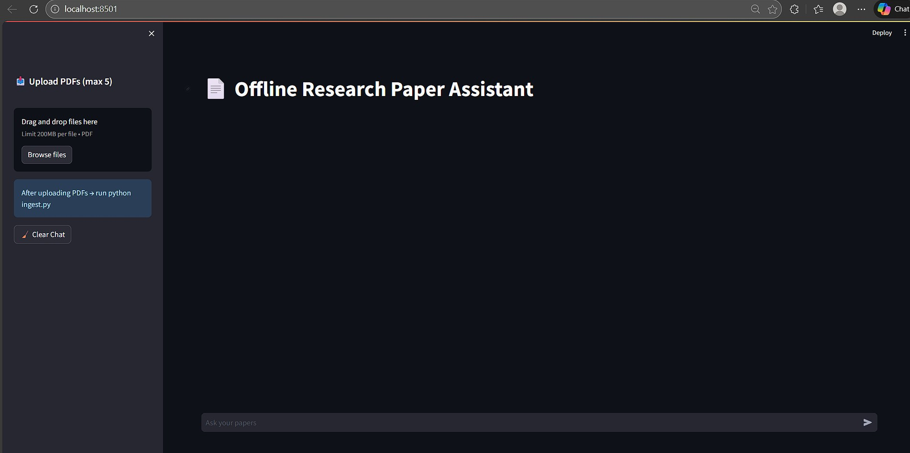
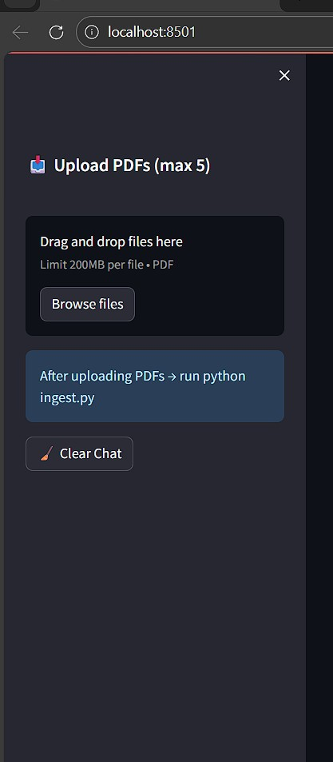

# 📚 Offline Research Paper Assistant (RAG + FAISS + Ollama)

An **offline ChatGPT-style AI assistant** that allows users to upload multiple research papers (PDFs), build semantic embeddings locally, and ask document-grounded questions using Retrieval-Augmented Generation (RAG).

Runs completely **offline** using:

• FAISS for vector search  
• Ollama for local LLM inference  
• Streamlit for Chat UI  

---

## 📑 Table of Contents

- Project Overview  
- Demo
- Key Features  
- Tech Stack  
- Folder Structure  
- Installation  
- How It Works  
- Architecture
- Limitations  
- Future Improvements  

---

## 🚀 Project Overview

This project enables semantic search and Q&A over multiple PDFs using RAG architecture.

Users can:

• Upload up to 5 PDFs  
• Build vector embeddings locally  
• Ask questions conversationally  
• Maintain chat history  
• Export conversations  
• Clear chat  
• Run fully offline  

Designed for:

✔ Research papers  
✔ Technical documents  
✔ PDFs  

---

## 📸 Demo Screenshots

### Chat Interface


### PDF Upload


### Question Answering


## ✨ Key Features

✅ Multi-PDF Support (up to 5 files)  
✅ Offline RAG Pipeline  
✅ FAISS Vector Database  
✅ Ollama Local LLM  
✅ ChatGPT-style UI  
✅ Conversation Memory  
✅ Sidebar Upload  
✅ JSON Chat History  
✅ Clear Chat Option

---

## 🧠 Tech Stack

- Python  
- LangChain  
- FAISS  
- Ollama  
- Streamlit  
- SentenceTransformers  
- HuggingFace Embeddings  

---

## 📁 Folder Structure
PDF_Reader/\
│── demo/\
│     ├── UI.jpg\
│     ├── sidebar.jpg\
│     ├── QA.jpg\
│     └── QA1.png\
├── app.py\
├── ingest.py\
├── rag_chain.py\
├── requirements.txt\
└── README.md


---

## ⚙ Installation

1️⃣ Create Environment

2️⃣ Install Dependencies
```bash 
pip install -r requirements.txt 
```

3️⃣ Install Ollama

Download Ollama:

https://ollama.com

Then pull model:

```bash
ollama pull llama3
```

Build Vector Index

```bash
python ingest.py
```

Launch App

```bash 
streamlit run app.py
```
---
## 🔄 How It Works

Upload PDFs (up to 5 files) via Streamlit sidebar or place them manually in the data folder.

Run ingest.py → creates FAISS vectorstore

After adding new PDFs, run ingest.py to rebuild the vector database.

Streamlit UI loads vectorstore

Questions retrieved + answered via Ollama

## ▶ Architecture:

PDF → Chunking → Embeddings → FAISS → Retriever → Ollama → Answer

---

## ⚠ Limitations

• Small LLM models may sometimes hallucinate\
• Requires re-running ingest.py after adding PDFs

---
## 🔮 Future Improvements

Citation highlighting

Hybrid search (BM25 + FAISS)

## 👩‍💻 Author

Shreya Sidabache

